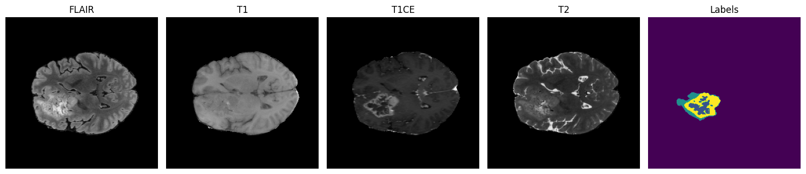
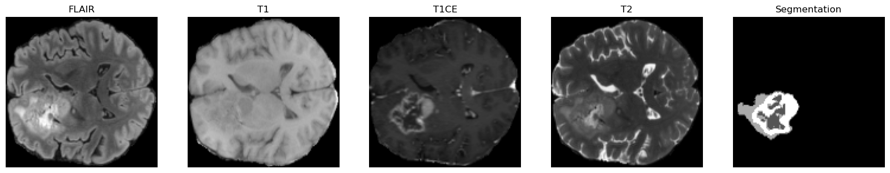
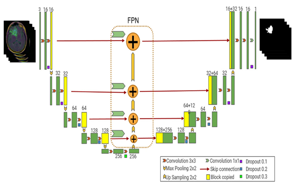

# Brain Tumor Segmentation (3D) Using FPN-3D U-Net

This repository contains the implementation of a deep learning-based brain tumor segmentation model using a hybrid **FPN-3D U-Net** architecture. This project addresses the critical need for automated, accurate, and efficient segmentation of brain tumors in MRI scans, aiding medical professionals in diagnosis and treatment planning.

---

## Table of Contents

1. [Project Overview](#project-overview)
2. [Dataset](#dataset)
3. [Preprocessing Pipeline](#preprocessing-pipeline)
4. [Model Architecture](#model-architecture)
5. [Training and Evaluation](#training-and-evaluation)
6. [Results and Analysis](#results-and-analysis)
7. [How to Use](#how-to-use)
8. [References](#references)

---

## Project Overview

### **Objective**
This project aims to develop a 3D segmentation model that can accurately segment brain tumors into four classes:

- Necrotic core
- Peritumoral edema
- Enhancing tumor
- Background

### **Why Automated Brain Tumor Segmentation?**
Manual segmentation of brain tumors is time-consuming, prone to variability, and dependent on expert radiologists. This project leverages deep learning to:
- Automate segmentation tasks.
- Provide consistent and reliable results.
- Improve diagnostic workflows, especially in resource-limited settings.

### **Key Features of the Project**
- Utilizes **BraTS21 Dataset**, which includes four MRI modalities: FLAIR, T1, T1Gd, and T2.
- Integrates a **Feature Pyramid Network (FPN)** with a **3D U-Net** for enhanced multi-scale feature extraction.
- Employs a custom **Dice-Cross Entropy Loss** function to handle class imbalance and improve segmentation accuracy.
- Comprehensive preprocessing pipeline to standardize and augment data.

---

## Dataset

The **BraTS21 Dataset** is a benchmark dataset for brain tumor segmentation. It contains 3D MRI scans with expert-annotated segmentation labels.

### **MRI Modalities**
1. **FLAIR**: Highlights abnormalities such as edema.
2. **T1-weighted**: Provides anatomical details of brain structures.
3. **Post-contrast T1-weighted (T1Gd)**: Enhances active tumor regions.
4. **T2-weighted**: Emphasizes fluid-rich areas and complements FLAIR.

### **Dataset Characteristics**
- 1,251 MRI scans.
- Four modalities per scan.
- Each scan is resampled to a uniform voxel size of **1 mm isotropic**.
- Segmentation annotations include four classes.

**Visualization of MRI Modalities**:


---

## Preprocessing Pipeline

A robust preprocessing pipeline was developed to standardize and prepare the dataset for training:

1. **Skull-Stripping**:
   - Removes non-brain tissues, focusing solely on the brain.

2. **Resampling**:
   - Resamples scans to a uniform voxel resolution of **1 mm isotropic**.

3. **Cropping to Foreground**:
   - Reduces unnecessary background regions by cropping around the brain.

4. **Intensity Normalization**:
   - Standardizes voxel intensity to have zero mean and unit variance.

5. **Augmentation**:
   - Includes random flips, rotations, and gamma adjustments to enhance diversity.

6. **Resizing**:
   - Rescales scans to a fixed size of **128 x 128 x 128** voxels.

**Example of a Preprocessed Image**:


---

## Model Architecture

The proposed model combines the **3D U-Net** with a **Feature Pyramid Network (FPN)** to leverage multi-scale feature extraction.

### **Key Components**
1. **Encoder**:
   - Extracts hierarchical features using convolutional blocks and downsampling.

2. **FPN Layers**:
   - Integrates multi-scale features for better context and detail.

3. **Decoder**:
   - Reconstructs high-resolution segmentation maps using skip connections and upsampling layers.

4. **Custom Loss Function**:
   - Combines Dice Loss and Cross-Entropy Loss to address imbalanced data.

### **FPN-3D U-Net Architecture**


---

## Training and Evaluation

### **Training Details**
- **Batch Size**: 1
- **Epochs**: 10
- **Learning Rate**: 0.0003
- **Optimizer**: Adam

### **Loss Function**
The combined loss function:
- **Dice Loss**: Measures overlap between predicted and true segmentation.
- **Cross-Entropy Loss**: Penalizes incorrect class predictions.

### **Evaluation Metrics**
- **Dice Similarity Coefficient (DSC)**: Evaluates segmentation accuracy.

---

## How to Use

### **Clone the Repository**
```bash
git clone https://github.com/your-username/brain-tumor-segmentation.git
cd brain-tumor-segmentation
```

### **Install Dependencies**
```bash
pip install -r requirements.txt
```

### **Preprocess the Dataset**
```bash
python preprocess.py
```

### **Train the Model**
```bash
python main.py --mode train
```

### **Evaluate the Model**
```bash
python main.py --mode test --weights final_model.pth
```

---

## References

1. Havaei, M., et al., "Brain Tumor Segmentation with Deep Neural Networks," *Medical Image Analysis*, 2017.
2. Bakas, S., et al., "Segmentation Labels and Radiomic Features for TCGA-GBM Collection," *The Cancer Imaging Archive*, 2017.
3. Çiçek, Ö., et al., "3D U-Net: Learning Dense Volumetric Segmentation from Sparse Annotation," *MICCAI 2016*.

---


